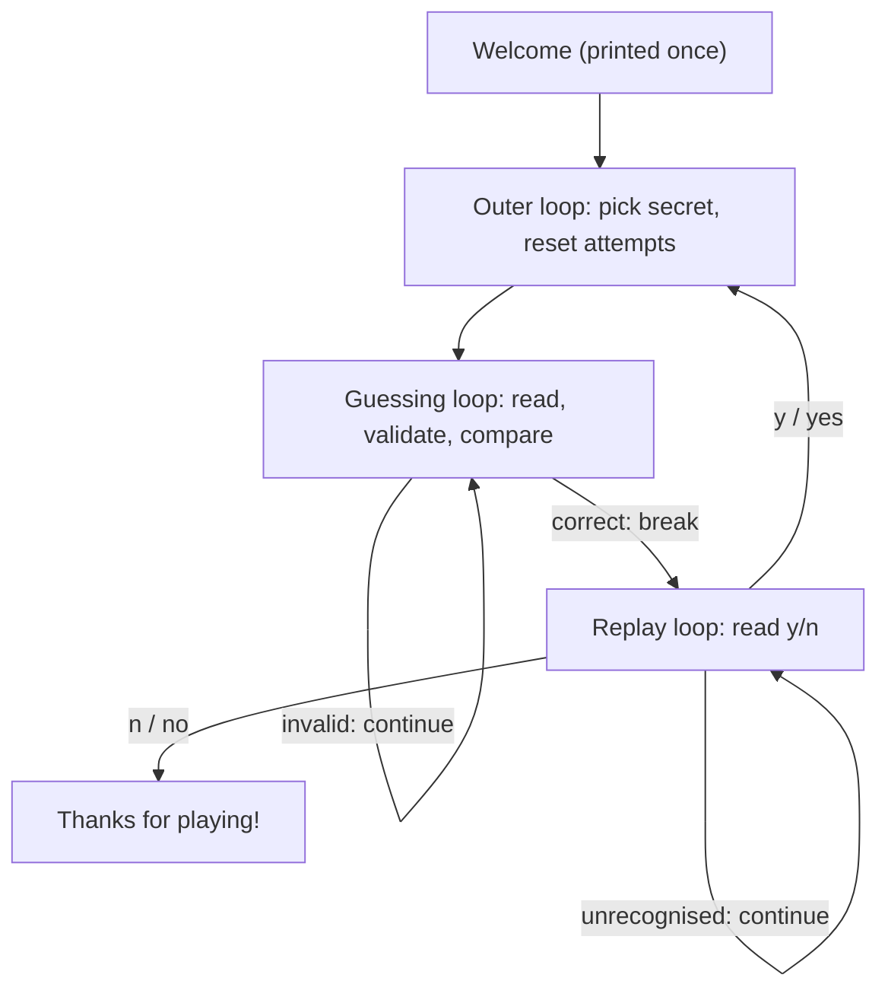

# Mini-Project — Number Guessing Game

> **Topic:** the whole of Week 3 in one program — nested `while True` loops, guard clauses, an accumulator, and the first random number you have ever asked a computer for
> **Lecture:** [02 — Loops](../lecture-notes/02-loops.md)
> **Difficulty:** every piece is something you have already done; holding three loops in your head at once is the work
> **Target time:** 2–3 hours, spread over more than one sitting
> **Why this one:** it is the first program where a variable has to live at exactly the right level. Put `attempts` one line too high and round two starts from round one's count. Nothing crashes. That is the lesson.

<!-- no-runnable-file: this page is the project brief, and the project's deliverable is a folder in your own repository with a script, a commit history, and a session you can show somebody. The runnable answer is guessing_game.py, which ships beside this page and is linked from Download and run. A file called README.py would be a strange thing to ask anybody to download. -->

## The Brief

This is the capstone of Week 3. Everything the week taught — `while` and
`for`, `break` and `continue`, conditionals, guard clauses, and the
accumulator pattern — comes together in one small game called **Guess The
Number**.

The computer picks a whole number between 1 and 100 and keeps it to
itself. You guess. It tells you `Too low.` or `Too high.` and you guess
again. When you get it, it tells you how many tries that took and offers
you another round with a fresh number.

Here is the session it should produce:

```text
Welcome to Guess The Number!
I am thinking of an integer between 1 and 100.

Your guess: 50
Too high.
Your guess: 25
Too low.
Your guess: 37
Too high.
Your guess: 30
Too low.
Your guess: 33
Correct! You got it in 5 attempts.

Play again? (y/n): y

I am thinking of an integer between 1 and 100.

Your guess: 42
Correct! You got it in 1 attempt.

Play again? (y/n): n
Thanks for playing!
```

**The one new thing: asking for a random number.** The standard library
has a module called `random`. Put `import random` at the top of your
file, and then `random.randint(1, 100)` hands you a whole number from 1
to 100, picked for you, with both ends included — 1 and 100 can both come
up. That is the only new tool this project needs, and it is one line.

(If you have already done [Challenge 2](../challenges/challenge-02-rps.md)
you have met `random.choice`, which picks an item out of a list. Same
module, different question.)

The rest of the project is Week 3 in a trench coat. What makes it harder
than the pieces is that there are **three** loops inside each other, and
each one owns something different:

1. The outer loop owns *a round*. It picks the secret and resets the
   attempt count.
2. The middle loop owns *a guess*. It reads, checks, compares, and only
   stops when you are right.
3. A small inner loop owns *one answer to one question* — the
   `Play again?` prompt — and keeps asking until it gets a yes or a no.

Deciding which loop a variable belongs to is the entire project. Get that
right and the code writes itself.

> *As a* learner who has met `while True`, `break`, `continue` and
> `+= 1`,
> *I want* to build a game that keeps state across rounds without
> getting confused,
> *so that* I find out what "which loop owns this variable" means.

## Starter

The scaffold is on its own page: **[starter.md](./starter.md)**. Copy the
code block from there into a file called `guessing_game.py` in your Week
3 folder, then fill in the five `TODO`s. It runs the moment you paste it,
so you are always editing a program that works rather than repairing one
that does not.

**One thing to know before you open it.** The scaffold and the answer on
this page are two different, both-correct completions of the same brief,
and they disagree about which week they are living in:

| | `starter.md` scaffold | The Solution below |
|---|---|---|
| Structure | three small functions — `read_guess`, `play_round`, `wants_rematch` | one flat script with comment banners |
| `def` | uses it, a week early | avoids it, because it is Week 4 |
| Bad input | `try` / `except ValueError` around `int()` | checks the characters before calling `int()`, because `try` is Week 6 |
| Replay prompt | anything that is not a yes counts as no | anything that is not `y`/`yes`/`n`/`no` asks again |

Neither is wrong. The scaffold reaches ahead because functions genuinely
make a guessing loop easier to read, and using them a week early costs
you nothing. The answer below stays inside Week 3 so that you can see
what this program looks like with only the tools you have actually been
taught — including what input validation looks like when you are not
allowed to catch an exception.

Follow whichever you like. If you follow the scaffold, read
*The Solution* anyway for the character-by-character validation, because
that idea outlives `try` / `except` by a mile.


**No setup needed — you can solve this one in the browser.** Open the starter in the [online code editor](../../../README.md) and run it there. Nothing to install, nothing to configure, and your work stays on your own machine.

## Requirements

1. The secret number comes from `random.randint(1, 100)`, which includes
   both 1 and 100.
2. The guessing loop keeps going until the guess matches the secret.
3. Each guess is compared to the secret and answered with `Too low.`,
   `Too high.`, or a congratulation.
4. A guess that is not a whole number — `abc`, `3.5`, an empty line —
   prints a polite message and asks again, **without** costing an
   attempt. Do not use `try` / `except` to find that out.
5. A guess that is a whole number but outside 1–100 prints a different
   polite message and asks again, also **without** costing an attempt.
   Two problems, two messages.
6. Attempts count only guesses that were whole numbers inside the range.
7. When the guess is right, print the attempt count, and get the
   grammar right: `1 attempt`, `2 attempts`.
8. Then ask `Play again? (y/n): `. Accept `y`, `yes`, `n` and `no` in any
   capitalisation. On a yes, start a fresh round with a **new** secret
   and the attempt count back at zero. On a no, print
   `Thanks for playing!` and stop.
9. Saved as `mini-project/guessing_game.py` in your Week 3 repository,
   committed and pushed.

## Constraints

- **No `def`.** Functions are Week 4. Organise the file with comment
  banners — `# === setup ===`, `# === guessing loop ===` — instead. The
  one exception is the `ask()` helper in the answer below, which is
  scaffolding rather than part of the game.
- **No `try` / `except`.** Exceptions are Week 6. `int("abc")` raises, so
  you never call `int()` until you already know the text is a number.
  Ask questions about the string first: slice off a leading sign, then
  walk its characters and confirm every one of them is a digit.
- **Two guards, two messages, both ending in `continue`.** `-5` is a
  perfectly good whole number and a useless guess, so it should be told
  it is out of range, not told it is not a number. Both statements are
  true of `-5`; only one of them helps.
- **`attempts += 1` goes below both guards.** Not at the top of the loop.
  This is the single line the whole rubric turns on, and putting it below
  the guards means an invalid guess *cannot* reach it — a much stronger
  guarantee than remembering to be careful.
- **`secret` and `attempts` are assigned at the top of the outer loop.**
  That is what makes a replay get a new number and a fresh count. Move
  either one above the outer loop and you have a different bug each time.
- **Standard library only.** `random` and `sys`.

## Expected output

The downloadable answer pins the random number generator with
`random.seed(77)`, so its session is the same every run — that is what
lets this page promise you an exact transcript. With nothing attached to
its input it also answers its own questions from a demo script. Real
stdout on CPython 3.13.2:

```text
$ python guessing_game.py
Welcome to Guess The Number!
I am thinking of an integer between 1 and 100.

Your guess: 50
Too high.
Your guess: 25
Too low.
Your guess: 37
Too high.
Your guess: 30
Too low.
Your guess: 33
Correct! You got it in 5 attempts.

Play again? (y/n): y

I am thinking of an integer between 1 and 100.

Your guess: 42
Correct! You got it in 1 attempt.

Play again? (y/n): n
Thanks for playing!
```

That is the brief's sample session, line for line. Round two lands on
`1 attempt` — singular — which is requirement 7 earning its place.

Now the part the sample session does not cover: every rejection path,
with the attempt counter proving none of them cost anything. Eleven lines
were fed in and six of them were thrown away:

```text
$ printf 'abc\n\n0\n101\n-5\n3.5\n  50  \n25\n37\n30\n33\nmaybe\nNO\n' | python guessing_game.py
Welcome to Guess The Number!
I am thinking of an integer between 1 and 100.

That is not a whole number. Try again.
That is not a whole number. Try again.
Please guess a number between 1 and 100.
Please guess a number between 1 and 100.
Please guess a number between 1 and 100.
That is not a whole number. Try again.
Too high.
Too low.
Too high.
Too low.
Correct! You got it in 5 attempts.

Please answer y or n.
Thanks for playing!
```

The prompts are missing because they go to the error stream, not the
normal one — *The Solution* explains why. Read the rejections against
the requirements:

| Input | What should happen | The line it produced |
|---|---|---|
| `abc` | not a number, free | `That is not a whole number. Try again.` |
| *(empty line)* | not a number, free — requirement 4 names this case | same message |
| `0` | a number, but below the range, free | `Please guess a number between 1 and 100.` |
| `101` | a number, but above the range, free | same message |
| `-5` | negative: the **range** message, not "not a number" | same message |
| `3.5` | not a whole number, free | `That is not a whole number. Try again.` |
| `  50  ` | spaces stripped, counts as attempt 1 | `Too high.` |
| `maybe` | not a yes or a no, so ask again | `Please answer y or n.` |
| `NO` | uppercase accepted as no | `Thanks for playing!` |

Eleven lines in, six rejected, and the program says **5 attempts**. That
one number is the proof of requirements 4, 5 and 6 together, and it is
the check worth running on your own version before you call it done.

## Steps

1. Copy the scaffold from [starter.md](./starter.md) into
   `mini-project/guessing_game.py` and run it once, unchanged:

   ```bash
   python mini-project/guessing_game.py
   ```

   It prints the welcome lines, admits it is not built yet, tells you
   what the secret would have been, and exits. That is your baseline.

2. Build the **outer loop and the secret** first, and cheat on purpose:
   print the secret each round while you work. A game you cannot see
   inside is a game you cannot debug. Delete that `print` at the end.

3. Build the **comparison** next — `Too low.` / `Too high.` / correct.
   With the secret still printed, you can check the hints are the right
   way round. Getting them backwards is easy and the game still "works",
   which is what makes it worth checking deliberately.

4. Add `attempts += 1` and the win message. Test the singular by
   guessing the printed secret on the first try.

5. Now add the **range guard**, and only then the **whole-number
   guard**. Do them in that order, because the range guard is the easy
   one and it teaches you where a guard goes. Test each one by typing
   the bad input and watching the attempt count *not* move.

6. Add the **replay loop** last. Answer `y` and check two things: the
   secret changed, and the attempt count went back to zero. Then answer
   `maybe` and check it asks again.

7. Run the whole rejection session from *Expected output*. Type all
   eleven lines by hand if you have not got a shell that does `printf`.
   You want `5 attempts` at the end.

8. Delete the file and write it again from a blank page. It takes about
   ten minutes the second time, and the second time is the one that
   proves you have Week 3.

9. Commit and push:

   ```bash
   git add curriculum/week-03-control-flow/mini-project/guessing_game.py
   git commit -m "Week 3 mini-project: number guessing game"
   git push
   ```

## The Solution

```python
"""Guess The Number: the computer picks 1-100, you close in on it.

Mini-project, Week 3, Code Crunch Convos. Counts only the guesses that
were whole numbers inside the range, so typos and out-of-range numbers
are free, then offers a rematch with a fresh secret.

Week 3 rules: the game itself uses no functions -- ``def`` is Week 4 --
and no ``try`` / ``except``, which is Week 6, so every guess is checked
character by character before ``int()`` ever sees it. The one helper
below, ``ask()``, is scaffolding rather than part of the answer. It is
what lets this file run and print a whole session when nobody is at the
keyboard.

``random.seed(SEED)`` is here for the same reason: it pins the secret
numbers so the printed session is the same every run. Delete that line
to play a real game.

Run it with::

    python guessing_game.py
"""

# === setup ===
import random
import sys

DIGITS: str = "0123456789"
LOW: int = 1
HIGH: int = 100

SEED: int = 77  # delete the random.seed call below to play a real game

# The session this file plays when its input stream is already finished.
DEMO_ANSWERS: list[str] = ["50", "25", "37", "30", "33", "y", "42", "n"]


def ask(prompt: str, demo: str) -> str:
    """Return the answer to ``prompt``, or a demo answer when nobody types.

    Args:
        prompt: the question to show, including its trailing space.
        demo: the answer to fall back on once the demo script above has
            run out. Every call site passes something that ends what it
            is asking about, so the file can never loop forever
            unattended.

    Returns:
        The line that was typed, or the next demo answer. A demo answer
        is echoed after the prompt on the normal output stream, so the
        printed session reads the same whether a person answered or not.
    """
    print(prompt, end="", file=sys.stderr, flush=True)
    try:
        return input()
    except EOFError:
        answer = DEMO_ANSWERS.pop(0) if DEMO_ANSWERS else demo
        print(f"{prompt}{answer}")
        return answer


random.seed(SEED)

print("Welcome to Guess The Number!")

# === outer "play again" loop ===
while True:
    secret = random.randint(LOW, HIGH)
    attempts = 0

    print(f"I am thinking of an integer between {LOW} and {HIGH}.")
    print()

    # === guessing loop ===
    while True:
        raw = ask("Your guess: ", str(secret)).strip()

        # Guard 1: it has to be a whole number.
        body = raw[1:] if raw[:1] in ("-", "+") else raw
        is_whole_number = body != ""
        for ch in body:
            if ch not in DIGITS:
                is_whole_number = False
                break
        if not is_whole_number:
            print("That is not a whole number. Try again.")
            continue

        guess = int(raw)

        # Guard 2: it has to be in range.
        if not LOW <= guess <= HIGH:
            print(f"Please guess a number between {LOW} and {HIGH}.")
            continue

        # Past both guards, so this one counts.
        attempts += 1

        if guess < secret:
            print("Too low.")
        elif guess > secret:
            print("Too high.")
        else:
            word = "attempt" if attempts == 1 else "attempts"
            print(f"Correct! You got it in {attempts} {word}.")
            break

    print()

    # === replay prompt ===
    while True:
        again = ask("Play again? (y/n): ", "n").strip().lower()
        if again in ("y", "yes", "n", "no"):
            break
        print("Please answer y or n.")

    if again in ("n", "no"):
        print("Thanks for playing!")
        break

    print()
```

**Three loops, three jobs.** Strip the bodies away and the program is
three `while True:` loops nested inside each other:



Every piece of state lives at the level that owns it. `secret` and
`attempts` are created at the top of the outer loop, which is exactly why
`attempts` goes back to zero on a replay and why the secret is a new
number each round. Move `attempts = 0` above the outer loop and round two
starts from round one's count. Move `secret` there and the player is
asked to guess the same number forever. Both bugs have a row in the
rubric, and both are fixed by asking "which loop owns this?" rather than
by patching afterwards.

**Why `while True` and not a real condition.** In all three loops the
reason to stop is only knowable *in the middle of the body*, after
something has been read. A header like `while guess != secret:` would
have to invent a value for `guess` before the first read — usually `0` or
`None` — which is a lie you then have to remember you told.

**Validation before conversion is the load-bearing decision.**
Requirement 4 says `abc` and an empty line must produce a message rather
than a crash. `int("abc")` raises, and `try` / `except` is Week 6, so the
only route left is to *ask questions about the string* until you are sure
`int()` will succeed:

```python
body = raw[1:] if raw[:1] in ("-", "+") else raw
is_whole_number = body != ""
for ch in body:
    if ch not in DIGITS:
        is_whole_number = False
        break
```

Four lines, and every one of them is load-bearing:

- **`raw[:1]`, not `raw[0]`.** Slicing an empty string gives you `""`;
  *indexing* an empty string raises `IndexError`. That one character is
  the difference between pressing Enter getting you a message and getting
  you a traceback, and requirement 4 names the empty line specifically.
- **The sign is peeled off and let through.** `-5` passes the digit check
  and is then caught by the range guard, so the player is told to stay
  between 1 and 100 rather than told that `-5` is not a number. That is
  requirement 5: check the *form* first, then the *meaning*, with a
  different message for each.
- **`is_whole_number = body != ""` before the loop.** If `body` is empty
  the `for` never runs at all, so the starting value has to already be
  the right answer for that case. Lecture 3 §1 calls this "initialize
  outside, update inside".
- **`break` on the first bad character.** There is nothing to learn from
  the rest of the string. Note that this `break` leaves the `for`, not
  the `while` around it — `break` only ever exits the innermost loop it
  is standing in.

This is not a workaround for not having `try` yet. Checking before you
convert survives Week 6 intact: `try` is for failures you could not have
foreseen, and somebody typing letters into a number prompt is not one of
those.

**Where `attempts += 1` sits is the whole rubric row.** It is below both
guards and above the comparison:

```python
        if not LOW <= guess <= HIGH:
            print(...)
            continue

        attempts += 1        # <- nothing invalid can reach this line
```

Because both guards end in `continue`, there is no path from a rejected
guess to the counter. You can *see* that it is unreachable, which is a
much better guarantee than testing it a few times.

`not LOW <= guess <= HIGH` is a chained comparison, negated. Read it as
`not (LOW <= guess <= HIGH)` — `not` binds more loosely than the
comparisons, so the parentheses are optional, and `guess` is only
evaluated once.

**Three cases over integers, so the `else` needs no condition.**
Reaching the `else` *proves* the guess equals the secret; there is
nothing else left. Writing `elif guess == secret:` with no `else` is not
wrong, but it leaves a fourth branch that can never fire and a reader who
has to work out why.

**The singular.** `word = "attempt" if attempts == 1 else "attempts"` is
the conditional expression from Lecture 1 §8. Guessing right on the first
try happens about once in a hundred rounds, and `You got it in 1
attempts.` is the kind of small wrongness that makes a finished program
feel unfinished.

**The replay prompt asks again instead of guessing.** The brief's
outline ends with `if again not in ("y", "yes"): break`, which meets
requirement 8 — but it means a typo like `yex` quietly ends a game the
player wanted to continue. Everywhere else in this program an
unrecognised answer asks again, so the replay prompt should not be the
one place that assumes. Note also that `again` is still readable *after*
the little loop that set it: Python has no block scope, so a name
assigned inside a loop outlives it.

**`ask()` puts the questions on the other stream.** A program has two
ways to send text out: the normal output stream, `stdout`, for its
answers, and the error stream, `stderr`, for everything else. `ask()`
prints the question to `stderr` with `end=""` so the cursor stays on the
line, and `flush=True` so the question appears before the program starts
waiting. Then it calls `input()` with **no argument** — because
`input("Your guess: ")` would print that prompt to stdout and mix the
questions into the game. That is why the piped session in
*Expected output* is nothing but results.

## Download and run

Download [guessing_game.py](./guessing_game.py) and run it:

```bash
python guessing_game.py
```

In your own terminal it asks you for guesses. Run by a script, or with
its input closed, it plays the demo session from *Expected output*.

You can also feed it guesses from the shell, one per line:

```bash
printf '50\n25\n37\n30\n33\nn\n' | python guessing_game.py
```

Because the questions go to the error stream, `>` captures the game on
its own:

```bash
python guessing_game.py > session.txt
```

**Delete the `random.seed(SEED)` line before you actually play.** With it
in place the secret is 33 every first round and 42 every second round.
That is what makes the printed session above reproducible, and it is also
the end of the game as a game.

`guessing_game.py` is the finished answer. The scaffold you build your
own version from is on [starter.md](./starter.md), and this page is the
brief — the project itself is the folder in your repository, with the
script, the commits, and a session you can show somebody.

## Common bugs to catch

**`guess = int(input("Your guess: "))` with no checking.** This is the
straight translation of requirement 4's first half and it fails the
second half. Type `abc`:

```text
Your guess: Traceback (most recent call last):
  File "guessing_game.py", line 7, in <module>
    guess = int(input("Your guess: "))
ValueError: invalid literal for int() with base 10: 'abc'
```

Pressing Enter with nothing typed gives the same exception with `''` on
the end. The rubric's "Invalid input does not crash" row goes straight to
Incomplete.

**You counted the attempt at the top of the loop.** It feels right — one
attempt per time round the loop — but the loop also goes round for typos
and out-of-range numbers. Run the rejection session from *Expected
output* against a version with the counter at the top and it announces
`You got it in 11 attempts.` The right answer is 5. Nothing errors and
the number is plausible, which is exactly why this is worth testing on
purpose.

**You drew the secret inside the guessing loop.** One level too deep and
a new number is picked before every guess. The game becomes unwinnable
except by a one-in-a-hundred fluke — and, cruelly, the hints still print,
so it *looks* like it is working. The tell is that the hints contradict
each other: 50 is too high, then 25 is too low, then 37 is too high,
forever. If the hints do not converge, check where the secret is drawn.

**`random.randrange(1, 100)` or `random.randint(0, 100)`.**
`randrange`'s upper bound is *excluded*, so `randrange(1, 100)` never
produces 100 and the game is quietly unfair. Two hundred thousand draws
of each, to show the difference:

```text
>>> import random
>>> xs = [random.randrange(1, 100) for _ in range(200000)]
>>> min(xs), max(xs)
(1, 99)
>>> ys = [random.randint(1, 100) for _ in range(200000)]
>>> min(ys), max(ys)
(1, 100)
```

`randint(0, 100)` has the opposite problem: it can pick 0, which your
range guard forbids the player from ever guessing. An unwinnable round
with no visible cause. Check the ends of any random call against the
range you actually mean.

**`raw.isdigit()` as the validator.** The obvious method, wrong twice.
`"3".isdigit()` is `True` and so is `"³".isdigit()`, but `int("³")`
raises, so a crash still gets through. And `"-5".isdigit()` is `False`,
so a negative guess is reported as "not a whole number" instead of "out
of range" — the less useful of the two messages. Checking each character
against `"0123456789"` has neither problem.

**`break` where `continue` belongs.** Using `break` for an invalid guess
leaves the guessing loop entirely and drops the player into
`Play again?` in the middle of a round. In the guessing loop exactly one
`break` is correct — the one under the winning guess — and every other
bail-out is a `continue`.

**The program hangs, or ends with `EOFError`.** Your version uses a plain
`input()` and something is running it with no keyboard attached. Piping
in too few lines does the same thing:

```text
Your guess: Traceback (most recent call last):
  File "guessing_game.py", line 31, in <module>
    raw = input("Your guess: ").strip()
          ~~~~~^^^^^^^^^^^^^^^^
EOFError: EOF when reading a line
```

That is not a bug in the game. Either feed it more lines, or use the
`ask()` shape from the answer, which has a demo answer ready when the
input runs out.

## Under the hood

<details>
<summary>Under the hood — randint, randrange, and the fence-post problem</summary>

`random.randint(1, 100)` includes both ends. `random.randrange(1, 100)`
excludes the top one. Two functions in the same module that read almost
identically and disagree about one number out of a hundred — that is not
a wart, it is two different conventions meeting.

`randrange` is named after `range`, and it follows `range`'s rule:
`range(1, 100)` gives you 1 up to but not including 100. That convention
— **half-open**, start included, stop excluded — is everywhere in Python
and in most languages, and there is a good reason for it. With half-open
ranges, the length is just `stop - start`, adjacent ranges join up with
no overlap and no gap (`range(0, 5)` and `range(5, 10)`), and an empty
range is `range(n, n)` rather than something awkward. Slicing follows the
same rule: `"hello"[1:3]` is `"el"`.

`randint` came from a different tradition — statistics, where "an integer
from 1 to 6" means a die, and a die has a 6 on it. It is a thin wrapper
around `randrange(a, b + 1)`.

The general shape of this mistake is the **fence-post problem**: to fence
10 metres with posts every metre you need 11 posts, not 10. Counting the
gaps and counting the posts give different answers, and off-by-one bugs
are what happens when you use one where you meant the other. Lecture 3
§10 calls it the bug of all bugs, and this is where you first meet it.

The habit that saves you: whenever you write a range of any kind, say out
loud what the smallest and largest legal values are, then check the call
produces exactly those. Two hundred thousand draws is a blunt instrument
and it settles the question in one line.

</details>

<details>
<summary>Under the hood — why a seeded game plays the same session twice</summary>

`random.randint` does not consult anything genuinely unpredictable. It
uses a **pseudo-random number generator**: arithmetic that starts from
one number and grinds out a long stream of numbers that look patternless.
The starting number is the **seed**.

Same seed, same stream, on every machine, forever:

```text
>>> import random
>>> random.seed(77)
>>> [random.randint(1, 100) for _ in range(5)]
[33, 42, 26, 31, 25]
>>> random.seed(77)
>>> [random.randint(1, 100) for _ in range(5)]
[33, 42, 26, 31, 25]
```

Nothing was remembered between those two runs. The second one produced
the same five numbers because it was the same arithmetic starting from
the same place. That is why the answer's first secret is 33 and its
second is 42, and why this page can promise you a transcript.

**Why the answer seeds itself.** "It worked when I ran it" is not a test
of a program whose behaviour changes every run. Pinning the seed turns a
random program into a repeatable one, so a page can print an exact
session and a checker can compare against it character by character.
Every serious test suite that touches randomness does this. It is also
why the file tells you, twice, to delete that line before you play.

**Where the seed comes from when you do not give one.** Python seeds the
generator for you the first time you use it, out of the operating
system's pool of real unpredictability — hardware event timings, mostly.
That is why an unseeded run gives a different secret each time.

**The rule worth carrying away.** Pseudo-random is fine for a game, a
shuffle, a sample, or a simulation. It is **not** fine for anything that
has to stay secret: if you can guess the seed you can reproduce the whole
stream, and Python's default generator was built for speed and
statistical quality rather than secrecy. When you need randomness nobody
can predict — passwords, session tokens, keys — the standard library has
a separate module called `secrets` that draws straight from the operating
system. Use that one, never `random`, for anything with a lock on it.

</details>

<details>
<summary>Under the hood — the guessing strategy, and why seven is the magic number</summary>

Play the game well and you will notice you never need more than seven
guesses for 1–100. That is not luck.

Guess the middle number and whatever the answer is, half the remaining
possibilities disappear. 100 candidates become 50, then 25, then 13, 7,
4, 2, 1. Seven steps. The general rule is that halving a range of `n`
takes about `log2(n)` steps, and `2 ** 7` is 128, the first power of two
above 100. That strategy is called **binary search**, and the reverse
mode under *Stretch* is the computer playing it against you.

It is worth knowing what this buys. Guessing one number at a time — 1,
then 2, then 3 — takes 50 guesses on average and 100 at worst. Binary
search takes 7 at worst. Widen the range to a million and linear guessing
needs half a million tries while binary search needs 20. That gap is why
"can I halve the problem?" is one of the first questions a programmer
asks, and you will meet it again every time a course mentions sorting or
searching.

The catch, and it is the whole catch: halving only works because the
answers `Too low.` and `Too high.` **order** the candidates. If the game
only said "wrong", there would be nothing to halve and you would be back
to 50 guesses. A hint is only useful if it removes possibilities, and the
better the ordering, the more it removes.

</details>

## Acceptance checklist

- [ ] `python guessing_game.py` welcomes the player and announces the
      range.
- [ ] The secret comes from `random.randint(1, 100)` and both 1 and 100
      can come up.
- [ ] The guessing loop keeps going until the guess matches, then stops.
- [ ] `abc`, an empty line, and `3.5` each print
      `That is not a whole number. Try again.` and cost nothing.
- [ ] `0`, `101` and `-5` each print
      `Please guess a number between 1 and 100.` and cost nothing.
- [ ] None of those produces a traceback.
- [ ] `  50  ` with spaces round it is accepted as 50.
- [ ] Feeding in the eleven-line rejection session from *Expected
      output* ends with `Correct! You got it in 5 attempts.`
- [ ] Winning on the first guess says `1 attempt`, not `1 attempts`.
- [ ] `y` starts a new round with a **new** secret and the count back at
      zero.
- [ ] `maybe` at the replay prompt asks again rather than quitting.
- [ ] `NO` in capitals prints `Thanks for playing!` and stops.
- [ ] No `def` and no `try` / `except` outside the supplied `ask()`.
- [ ] Four-space indentation, a docstring at the top, constants in
      `UPPER_CASE`, comment banners matching the brief's outline.
- [ ] At least two stretch goals in place, and you can say in one
      sentence what each changed.
- [ ] Saved as `mini-project/guessing_game.py`, committed and pushed.

And the rubric, for when you grade yourself or a peer reviews you. Aim
for Complete on at least the first four rows before you call it done:

| Criterion | Incomplete | Partial | Complete |
|-----------|------------|---------|----------|
| Secret number is random in `[1, 100]` | Hard-coded value | Random but wrong range | `random.randint(1, 100)` |
| Loops until correct | Single guess only | Loops but no end condition | Clean loop with `break` on correct |
| Invalid input does not crash | Crashes on letters | Crashes on some inputs | Polite re-prompt every time |
| Attempt counter is accurate | Not tracked | Counts invalid guesses too | Counts valid in-range guesses only |
| Replay loop works | No replay | Replay loops but does not reset secret | Fresh random number every replay |
| Code style | Mixed tabs and spaces, no docstring | Some inconsistency | PEP 8 indentation, top-of-file docstring |
| Stretch features | None | One stretch goal | Two or more stretch goals |

The row people most often lose is **attempt counter**, and they lose it
because they only tested with valid input. Test with rubbish first. Valid
input is the easy case.

## Stretch

**The plain `input()` version.** The downloadable answer uses `ask()` so
it runs with nobody at the keyboard, and a seed so its session is
reproducible. Strip both out and the program is shorter, stays entirely
inside Week 3 — no `def`, no `try` — and is a real game again. This is
the version to write if you want to prove to yourself you can do it with
only what Week 3 gave you:

```python
"""Week 3 mini-project - Guess The Number.

The computer picks a random integer in [1, 100]; you guess until you
hit it, then choose whether to play again. Guesses that are not whole
numbers, or that fall outside 1-100, are rejected without costing an
attempt.

Week 3 rules: no functions (that is Week 4) and no try/except (Week 6),
so every guess is validated character by character before int() sees it.
"""

# === setup ===
import random

DIGITS = "0123456789"
LOW = 1
HIGH = 100

print("Welcome to Guess The Number!")

# === outer "play again" loop ===
while True:
    secret = random.randint(LOW, HIGH)
    attempts = 0

    print(f"I am thinking of an integer between {LOW} and {HIGH}.")
    print()

    # === guessing loop ===
    while True:
        raw = input("Your guess: ").strip()

        # Guard 1: it has to be a whole number.
        body = raw[1:] if raw[:1] in ("-", "+") else raw
        is_whole_number = body != ""
        for ch in body:
            if ch not in DIGITS:
                is_whole_number = False
                break
        if not is_whole_number:
            print("That is not a whole number. Try again.")
            continue

        guess = int(raw)

        # Guard 2: it has to be in range.
        if not LOW <= guess <= HIGH:
            print(f"Please guess a number between {LOW} and {HIGH}.")
            continue

        # Past both guards, so this one counts.
        attempts += 1

        if guess < secret:
            print("Too low.")
        elif guess > secret:
            print("Too high.")
        else:
            word = "attempt" if attempts == 1 else "attempts"
            print(f"Correct! You got it in {attempts} {word}.")
            break

    print()

    # === replay prompt ===
    while True:
        again = input("Play again? (y/n): ").strip().lower()
        if again in ("y", "yes", "n", "no"):
            break
        print("Please answer y or n.")

    if again in ("n", "no"):
        print("Thanks for playing!")
        break

    print()
```

One real session, unseeded, playing the halving strategy from the third
*Under the hood* block:

```text
$ python guessing_game.py
Welcome to Guess The Number!
I am thinking of an integer between 1 and 100.

Your guess: 50
Too low.
Your guess: 75
Too high.
Your guess: 62
Too high.
Your guess: 56
Too low.
Your guess: 59
Too high.
Your guess: 57
Too low.
Your guess: 58
Correct! You got it in 7 attempts.

Play again? (y/n): n
Thanks for playing!
```

Seven guesses, the theoretical worst case for 1–100, hit exactly. Your
session will not match, and that is the point — this is the version where
the "secret is genuinely random" criterion can actually be checked. It
also stops dead the moment nothing is typing at it, which is the whole
reason the downloadable file is written the other way.

### Stretch 1 — difficulty levels

Ask for a level at the top of each round, and let the level supply the
range *and* everything derived from it:

```python
# pick -> (name, low, high, max attempts)
LEVELS = {
    "1": ("easy", 1, 10, 5),
    "2": ("medium", 1, 100, 10),
    "3": ("hard", 1, 1000, 15),
}

while True:
    pick = input("Choose a difficulty 1-3: ").strip()
    if pick in LEVELS:
        break
    print("Please choose 1, 2, or 3.")

level_name, low, high, max_attempts = LEVELS[pick]
secret = random.randint(low, high)
```

**The rules move out of the code and into data.** Adding an
"insane (1–10000)" level becomes one line in `LEVELS` and no change to
the game loop at all — the same payoff the
[rock-paper-scissors answer](../challenges/challenge-02-rps.md) gets from
putting its win table in a set. `LEVELS[pick]` is a dictionary lookup,
properly Week 5 material; `pick in LEVELS` tests the *keys*, which is why
the validation loop reads so naturally.

`LOW` and `HIGH` become the lowercase, per-round `low` and `high`,
because they are no longer constants. The range guard and both messages
pick up the new values for free, because they were written in terms of
the names rather than the numbers `1` and `100`. That is the reason the
base answer used named constants for a game that only ever had one range.

**The attempt caps are not arbitrary.** Halving needs about `log2(range)`
guesses: 4 for 1–10, 7 for 1–100, 10 for 1–1000. Caps of 5, 10 and 15
leave a comfortable margin above perfect play — generous enough that a
thoughtful player will not lose, tight enough that random stabbing will.

### Stretch 2 — best score across the session

```python
best_attempts = None       # before the outer loop
best_level = ""
```

```python
            if best_attempts is None or attempts < best_attempts:
                if best_attempts is not None:
                    print(f"New record - you beat {best_attempts}!")
                best_attempts = attempts
                best_level = level_name
            print(f"Session best: {best_attempts} on {best_level}.")
```

**`None` means "no record yet", and `is None` is how you ask.** Lecture 1
§4 is explicit: `is` for the singletons `None`, `True` and `False`, `==`
for values. Starting at `0` instead would be a bug you would never spot,
because `attempts < 0` is never true and the record would never update.
Starting at a big number like `999` works but bakes in a magic constant
and brags "you beat 999" on the first win.

**Short-circuiting is doing real work in that condition.**
`best_attempts is None or attempts < best_attempts` relies on `or`
stopping as soon as the left side is true. Swap the two halves round and
the first round raises
`TypeError: '<' not supported between instances of 'int' and 'NoneType'`.
Guard conditions have an order for the same reason `elif` chains do.

### Stretch 3 — warmer and colder

```python
        gap = abs(guess - secret)
```

```python
        if previous_gap < 0:
            print()
        elif gap < previous_gap:
            print(" Warmer.")
        elif gap > previous_gap:
            print(" Colder.")
        else:
            print(" Same distance.")

        previous_gap = gap
```

with `previous_gap = -1` set at the top of each round, and the
too-low/too-high prints changed to `print("Too low.", end="")` so the
hint lands on the same line.

**`abs(guess - secret)` is the distance, and distance is the only thing
"warmer" can mean.** Comparing the raw difference breaks the moment the
player crosses the secret: 30 and 36 are equally close to 33, but
`30 - 33` is `-3` and `36 - 33` is `+3`, so a signed comparison would
call the second one colder when it is exactly as good.

**`previous_gap = -1` is a sentinel** — a value outside the range of real
answers, used to mean "nothing yet". A distance is never negative, so
`-1` is unambiguous. `None` would work too and would be more idiomatic;
`-1` is used here to show you the other common technique.

**Three branches, not two.** `gap == previous_gap` really happens — guess
5 then 9 when the secret is 7 — and folding it into "colder" is a small
lie.

Be aware this hint leaks a *lot*: "warmer" tells the player which side of
the midpoint between their last two guesses the secret is on, which is
nearly as strong as the high/low hint itself. Fine for a toy, and worth
noticing as a design fact.

### Stretch 4 — cap the attempts

This is the one that pays off the `while` / `else` clause from Lecture 2
§8, which feels like trivia until a problem shaped exactly like this
turns up:

```python
    while attempts < max_attempts:
        raw = input(f"Your guess ({max_attempts - attempts} left): ").strip()
        ...
        if guess == secret:
            print(...)
            break
        ...
    else:
        print(f"Out of guesses! The number was {secret}.")
```

**`else` on a loop runs only when the loop was *not* broken out of.**
Winning `break`s, so the `else` is skipped. Running out makes
`attempts < max_attempts` go false, the loop ends normally, and the
`else` fires. The alternative is a `found = False` flag set before the
loop, flipped on the win and tested afterwards — three extra lines and
one more piece of state to keep honest. The loop `else` is the same idea
with the bookkeeping done by the language, and it is the same "I searched
and did not find it" shape the prime-testing exercise drills.

**The header is a real condition now, so `while True` goes away.** The
loop has a natural end — the budget running out — so it can be stated
where a reader will look for it. Keep `while True` for loops that
genuinely only end from the inside.

**Invalid guesses are still free, and the cap gets that right for free.**
Both guards `continue` without touching `attempts`, so the loop condition
has not moved and the player has lost nothing. The `{max_attempts -
attempts} left` in the prompt makes it visible: type rubbish and the
number in the prompt does not budge.

Stretches 1 to 4 compose into one file. Save it as
`guessing_game_deluxe.py`:

```python
"""Week 3 mini-project, stretch version - Guess The Number deluxe.

Stretch goals 1-4 in one file: difficulty levels, a session best score,
warmer/colder hints, and a per-round attempt cap enforced with a
while/else. Still no functions and no try/except.
"""

import random

DIGITS = "0123456789"

# pick -> (name, low, high, max attempts)
LEVELS = {
    "1": ("easy", 1, 10, 5),
    "2": ("medium", 1, 100, 10),
    "3": ("hard", 1, 1000, 15),
}

best_attempts = None
best_level = ""

print("Welcome to Guess The Number!")

while True:
    # === stretch 1: difficulty ===
    print()
    print("1) Easy    (1-10, 5 guesses)")
    print("2) Medium  (1-100, 10 guesses)")
    print("3) Hard    (1-1000, 15 guesses)")
    while True:
        pick = input("Choose a difficulty 1-3: ").strip()
        if pick in LEVELS:
            break
        print("Please choose 1, 2, or 3.")

    level_name, low, high, max_attempts = LEVELS[pick]
    secret = random.randint(low, high)
    attempts = 0
    previous_gap = -1          # -1 means "no previous guess yet"

    print(f"I am thinking of an integer between {low} and {high}.")
    print(f"You have {max_attempts} guesses.")
    print()

    # === stretch 4: capped guessing loop ===
    while attempts < max_attempts:
        raw = input(f"Your guess ({max_attempts - attempts} left): ").strip()

        body = raw[1:] if raw[:1] in ("-", "+") else raw
        is_whole_number = body != ""
        for ch in body:
            if ch not in DIGITS:
                is_whole_number = False
                break
        if not is_whole_number:
            print("That is not a whole number. Try again.")
            continue

        guess = int(raw)
        if not low <= guess <= high:
            print(f"Please guess a number between {low} and {high}.")
            continue

        attempts += 1
        gap = abs(guess - secret)

        if guess == secret:
            word = "attempt" if attempts == 1 else "attempts"
            print(f"Correct! You got it in {attempts} {word}.")
            # === stretch 2: best score ===
            if best_attempts is None or attempts < best_attempts:
                if best_attempts is not None:
                    print(f"New record - you beat {best_attempts}!")
                best_attempts = attempts
                best_level = level_name
            print(f"Session best: {best_attempts} on {best_level}.")
            break

        if guess < secret:
            print("Too low.", end="")
        else:
            print("Too high.", end="")

        # === stretch 3: warmer / colder ===
        if previous_gap < 0:
            print()
        elif gap < previous_gap:
            print(" Warmer.")
        elif gap > previous_gap:
            print(" Colder.")
        else:
            print(" Same distance.")

        previous_gap = gap
    else:
        print(f"Out of guesses! The number was {secret}.")

    # === replay prompt ===
    print()
    while True:
        again = input("Play again? (y/n): ").strip().lower()
        if again in ("y", "yes", "n", "no"):
            break
        print("Please answer y or n.")

    if again in ("n", "no"):
        print("Thanks for playing!")
        break
```

All four stretches in one session. `random.seed(0)` makes the easy-mode
secrets `7`, `7`, `1` in that order, so round 1 wins on the last allowed
guess, round 2 sets a record, and round 3 runs the budget out:

```bash
printf '1\n1\n10\n2\n4\n7\ny\n1\n8\n7\ny\n1\n10\n9\n8\n7\n6\nn\n' | python -c "import random; random.seed(0); exec(open('guessing_game_deluxe.py').read())"
```

```text
Welcome to Guess The Number!

1) Easy    (1-10, 5 guesses)
2) Medium  (1-100, 10 guesses)
3) Hard    (1-1000, 15 guesses)
Choose a difficulty 1-3: I am thinking of an integer between 1 and 10.
You have 5 guesses.

Your guess (5 left): Too low.
Your guess (4 left): Too high. Warmer.
Your guess (3 left): Too low. Colder.
Your guess (2 left): Too low. Warmer.
Your guess (1 left): Correct! You got it in 5 attempts.
Session best: 5 on easy.

Play again? (y/n): 
1) Easy    (1-10, 5 guesses)
2) Medium  (1-100, 10 guesses)
3) Hard    (1-1000, 15 guesses)
Choose a difficulty 1-3: I am thinking of an integer between 1 and 10.
You have 5 guesses.

Your guess (5 left): Too high.
Your guess (4 left): Correct! You got it in 2 attempts.
New record - you beat 5!
Session best: 2 on easy.

Play again? (y/n): 
1) Easy    (1-10, 5 guesses)
2) Medium  (1-100, 10 guesses)
3) Hard    (1-1000, 15 guesses)
Choose a difficulty 1-3: I am thinking of an integer between 1 and 10.
You have 5 guesses.

Your guess (5 left): Too high.
Your guess (4 left): Too high. Warmer.
Your guess (3 left): Too high. Warmer.
Your guess (2 left): Too high. Warmer.
Your guess (1 left): Too high. Warmer.
Out of guesses! The number was 1.

Play again? (y/n): Thanks for playing!
```

The typed guesses are not echoed, because they came from a pipe rather
than a keyboard. **Round 1** shows warmer and colder tracking real
distances — guesses `1, 10, 2, 4` against a secret of `7` give gaps of
`6, 3, 5, 3`, so warmer, colder, warmer — and wins on the very last
allowed guess, which proves the cap counts to exactly `max_attempts`
rather than stopping one early. **Round 2** wins in 2 and prints the
record line. **Round 3** is the important one: five wrong guesses, the
budget hits zero, the `while` condition goes false without a `break`, and
the `else` fires. That is the branch this stretch exists to exercise, and
it is the one a flag variable would have made you write by hand.

The `Same distance.` branch needs two guesses equally far from the
secret. With the same seed, guess `5` then `9` against a secret of `7`:

```bash
printf '1\n5\n9\n7\nn\n' | python -c "import random; random.seed(0); exec(open('guessing_game_deluxe.py').read())"
```

```text
Your guess (5 left): Too low.
Your guess (4 left): Too high. Same distance.
Your guess (3 left): Correct! You got it in 3 attempts.
Session best: 3 on easy.
```

The `exec(open(...).read())` wrapper exists only so the seed can be set
without editing the file. It is a test harness, not a pattern — never
ship code that does that.

### Stretch 5 — reverse mode

Now the computer guesses and you answer. Save as
`guessing_game_reverse.py`:

```python
"""Week 3 mini-project, stretch 5 - reverse mode.

You think of an integer between 1 and 100 and the computer finds it by
binary search. You answer h (my guess was too high), l (too low) or
c (correct).
"""

LOW = 1
HIGH = 100

print(f"Think of an integer between {LOW} and {HIGH}. I will find it.")
print("After each guess answer h (too high), l (too low) or c (correct).")
print()

low = LOW
high = HIGH
attempts = 0

while low <= high:
    guess = (low + high) // 2
    attempts += 1
    print(f"My guess: {guess}")

    while True:
        answer = input("Too high, too low, or correct? (h/l/c) ").strip().lower()
        if answer in ("h", "high", "l", "low", "c", "correct"):
            break
        print("Please answer h, l or c.")

    if answer in ("c", "correct"):
        word = "guess" if attempts == 1 else "guesses"
        print(f"Got it in {attempts} {word}.")
        break

    if answer in ("h", "high"):
        high = guess - 1       # the secret is below my guess
    else:
        low = guess + 1        # the secret is above my guess
else:
    print("No number fits all of your answers - one of them contradicted an earlier one.")
```

**`low` and `high` are the numbers still possible**, and every answer
shrinks that range. Guessing the midpoint `(low + high) // 2` halves it
each time, so 100 candidates need at most 7 guesses. `//` is floor
division; `/` would give a float and the guess would print with a decimal
point on it.

**The `- 1` and `+ 1` are the part people get wrong.** If your guess of
50 was too high, the secret is not 50 *and* not above it, so the new
upper bound is `49`. Leave the `- 1` off and the range stops shrinking
once one candidate is left: `low` and `high` both sit at 50, the midpoint
is 50, and the program guesses 50 forever.

**The `while` / `else` catches a player who is not consistent.** If every
answer fits *some* number, the search always ends on that number. If the
player contradicts themselves, `low` climbs past `high`, the range of
possible numbers is empty, the loop ends without a `break`, and the
`else` says so.

A normal win — answering `h, l, h, l, h, l, c` corresponds to a secret of
33:

```bash
printf 'h\nl\nh\nl\nh\nl\nc\n' | python guessing_game_reverse.py
```

```text
Think of an integer between 1 and 100. I will find it.
After each guess answer h (too high), l (too low) or c (correct).

My guess: 50
Too high, too low, or correct? (h/l/c) My guess: 25
Too high, too low, or correct? (h/l/c) My guess: 37
Too high, too low, or correct? (h/l/c) My guess: 31
Too high, too low, or correct? (h/l/c) My guess: 34
Too high, too low, or correct? (h/l/c) My guess: 32
Too high, too low, or correct? (h/l/c) My guess: 33
Too high, too low, or correct? (h/l/c) Got it in 7 guesses.
```

Watch the range collapse: 1–100, 1–49, 26–49, 26–36, 32–36, 32–33,
33–33.

And the contradiction path — answer "too low" every single time, which no
real number can satisfy:

```bash
printf 'l\nl\nl\nl\nl\nl\nl\n' | python guessing_game_reverse.py
```

```text
My guess: 50
Too high, too low, or correct? (h/l/c) My guess: 75
Too high, too low, or correct? (h/l/c) My guess: 88
Too high, too low, or correct? (h/l/c) My guess: 94
Too high, too low, or correct? (h/l/c) My guess: 97
Too high, too low, or correct? (h/l/c) My guess: 99
Too high, too low, or correct? (h/l/c) My guess: 100
Too high, too low, or correct? (h/l/c) No number fits all of your answers - one of them contradicted an earlier one.
```

After guessing 100 and being told it is still too low, `low` becomes
`101`, `high` is `100`, `low <= high` is false, and the `else` explains
what happened. Seven answers again — halving takes the same number of
steps to prove nothing fits as it does to find something.

### What Week 4 will change

Count the copies of the digit-checking block: the base game has one, the
deluxe version has one, and several of the homework answers have one.
That is the clearest possible argument for functions, and it is the
argument Week 4 opens with. When you get there this becomes:

```python
def read_int(prompt: str, low: int, high: int) -> int:
    ...
```

called once from each place, and `guessing_game.py` loses about a third
of its lines without losing a single behaviour. Notice the duplication
now, while it is still irritating — that irritation is what makes `def`
feel like a relief instead of more syntax to memorise.
