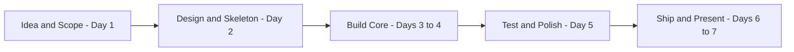
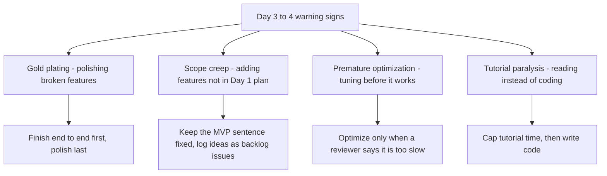

# Lecture 1 — Planning Your Capstone

A capstone fails or succeeds in its first day. Not because Day 1 contains
the cleverest code — it contains essentially no code — but because Day 1
decides what is in the project and, more importantly, what is *not*. By
the end of this lecture you will know how to pick a project you can
actually finish, how to scope it down to a defensible minimum viable
product, how to break that MVP into milestones with dates, and how to
recognise the four anti-patterns that quietly murder learner projects
around Day 4.

## Why planning matters more than usual

In every previous week of this bootcamp, the project was handed to you.
Someone — your mentor, the curriculum, the worksheet — decided what to
build. This week, *you* decide. That sounds liberating; in practice it is
the hardest part. Without a strong constraint up front, two things will
happen. First, you will spend the next 36 hours of build time gradually
expanding what "done" means. Second, you will hit Day 6 with something
half-built, panic, and ship the wrong half. Both are avoidable, and the
escape hatch is a one-page plan written on Day 1.

The plan is short on purpose. A long plan is a procrastination device. A
one-pager forces you to choose. You cannot list ten features on one page —
you will have to pick three. Three features you can actually finish beats
ten features you cannot.

## How to pick a project

Three criteria need to line up. Drop any one and your capstone is in
trouble.

### 1. Scope you can complete in seven days

Seven days, with maybe four hours of build time per day, is *small*. If
your gut says "I could build this in a weekend", that is roughly right.
If your gut says "this is a real product", scope it down by 80% and try
again. The phrase to internalise is "smaller than you think". A
capstone-sized project is something like "a CLI that summarises my GitHub
notifications" — not "a Slack competitor for developers".

A useful trick: write down your idea, then write down a *one-tenth scale*
version. Build the one-tenth version. Habit tracker for one user with no
sharing, no streak history, no charts? That fits. Habit tracker with
groups, mobile push, and gamified leaderboards? That does not.

### 2. Genuine interest

You will spend roughly 25 hours staring at this code. If you do not care
about the problem, you will quietly stop on Day 4. Pick a topic from your
own life: a tool that would make your job slightly easier, a dataset
about a city you used to live in, an automation for a hobby. The bar is
"would I use this myself, or talk about it to a friend over coffee?"

Do not pick something because it sounds impressive. A boring problem you
genuinely care about ships. An exciting problem you are bored by does not.

### 3. Achievability with what you already know

You have learned Python, Flask, SQLite, requests, pytest, pandas, and a
sprinkle of scikit-learn. That stack is plenty to build a portfolio
project. The capstone is not where you learn React, Kubernetes, Rust, or
a new ML framework — those are post-bootcamp projects. If you find
yourself reaching for a brand-new technology to *enable* the capstone, you
have picked the wrong capstone.

This is the rule that learners break most often. They reason: "I want to
learn X, so my capstone will use X." They then spend the first three days
fighting X's tutorial, not their own project. By Day 5 they have a tour of
X and no working capstone. Be honest with yourself: this week is for
*demonstrating* what you have learned, not adding to it. Bookmark the new
thing for Project 2.

## MVP thinking

MVP — "minimum viable product" — is the smallest thing that someone, even
if that someone is only you, would actually use. Two failure modes
surround it.

The first is **over-MVPing**: stripping so much out that the result is not
*viable*. A habit tracker with no way to add a habit is not an MVP; it is
a placeholder. The product must do its core job end-to-end, even if
narrowly.

The second is **under-MVPing**: claiming you have an MVP when you really
have a wish list. If your "MVP" has six features and only one of them
works, you do not have an MVP, you have a sketch.

Here is a useful drill. Write your MVP as a single sentence in the form:

> *"<User> can <verb> <object> and see <result>."*

For example:

> *"A logged-in user can record a daily check-in for one habit and see
> their current streak."*

If that single sentence is true on the deployed app, the MVP is done.
Everything else — multiple habits, charts, friend leaderboards — is
*nice-to-have*. Write the MVP sentence at the top of `docs/PROPOSAL.md`
and *do not change it during the week*. Changing the MVP mid-week is the
single most reliable way to ship nothing.

## User stories: a tiny dose

You do not need to learn formal agile vocabulary. But one tiny piece is
useful: the **user story**. A user story is a sentence in the form

> *"As a <user type>, I want to <do something> so that <benefit>."*

For example:

> *"As a habit tracker user, I want to mark today's habit as done so that
> my streak continues."*

User stories are useful because they keep you focused on outcomes, not
implementation. "Implement an SQLAlchemy model with a UTC timestamp" is
not a user story — nobody wants that. "See my streak go up when I check in
today" is.

Write three to five user stories on Day 1. Number them. Each one becomes
a GitHub issue on Day 2. Each issue becomes a pull request later in the
week. The user stories are the spine of the project.

## Breaking work into milestones

You have five milestones already, courtesy of this curriculum:

1. **Idea & Scope** — Day 1.
2. **Design & Skeleton** — Day 2.
3. **Build Core** — Days 3–4.
4. **Test & Polish** — Day 5.
5. **Ship & Present** — Days 6–7.


*The five capstone milestones, in order.*

Inside Milestone 3 — the only one that is really "building" — break the
work into half-day chunks. Each chunk should be small enough that you can
guess whether it took longer than expected. "Implement the user model"
is roughly half a day. "Build the app" is not a chunk; it is the whole
project.

A typical Day 3 plan for a web app capstone might look like:

- **AM** — User and Habit models in SQLAlchemy, with one passing test.
- **PM** — Routes for signup, login, logout, and one protected page.

A typical Day 4:

- **AM** — Routes to add a habit, check in, and view today's habits.
- **PM** — Templates and bare-minimum styling (Tailwind via CDN, Pico.css,
  or hand-rolled — your choice).

Write these chunks at the bottom of `docs/PROPOSAL.md`. Update the chunks
each evening with a tick or a note about what slipped.

## Tech stack: choose, then stop choosing

A surprising amount of learner time evaporates on "should I use Flask or
FastAPI? SQLite or Postgres? pip or poetry?" Pick. Move on. For this
capstone, sensible defaults are:

- **Web** — Flask (already covered in Week 9) with SQLite. Use FastAPI
  only if you have a specific async or API-doc reason; you do not.
- **Packaging** — `pyproject.toml` with a `[project]` table, plus a thin
  `requirements.txt` if you want pinning. Avoid Poetry unless you already
  know it.
- **Testing** — `pytest` with `pytest-cov`.
- **Lint/format** — `ruff` (lint + format) is the modern, fast choice;
  `black` + `flake8` is the older, fine alternative.
- **Type checks** — type hints in the code; `mypy` is optional.
- **CI** — GitHub Actions. There is a starter workflow in your Week 11
  notes.

Write the chosen stack at the top of `docs/PROPOSAL.md`. If you change it
mid-week, change it on the page so future-you (and reviewers) can see why.

## Anti-patterns to recognise

Four failure modes show up almost every cohort. Each has a tell.

### Gold-plating

**Tell:** You spend Day 4 perfecting the visual design of a feature whose
backend does not work yet.

Gold-plating is polishing something past the point where extra polish
helps. Fancy CSS on broken routes is gold-plating. A perfectly tuned ML
model with no deployment is gold-plating. A 600-line README for a
50-line script is gold-plating. The cure is to finish the *end-to-end*
flow first, even crudely, and only polish what is left after the MVP
sentence is true.

### Scope creep

**Tell:** Your Day 4 commits add features you did not list in Day 1's
proposal.

Scope creep is the slow widening of the MVP. It happens in tiny steps —
"while I'm in here, I might as well add ...". Each step seems harmless;
together they consume a day you cannot afford. The cure is the
unmodifiable MVP sentence and a discipline of opening a *backlog* issue
(label: `nice-to-have`) instead of writing the code now.

### Premature optimization

**Tell:** You are profiling code or refactoring "for performance" before
the feature works for one user.

Optimisation matters when something is measurably slow for a real user.
For a capstone, that is approximately never. Database indexes for a
demo with 12 rows do not matter. Replacing a clear function with a clever
one to save 2 ms does not matter. Build it correctly first; optimise only
if a reviewer says "this is too slow".

### Tutorial paralysis

**Tell:** It is Day 3 and you are still reading tutorials, not writing
project code.

You learn a tool by *using* it on the project, not by reading three more
articles about it. The moment you have a vague sense of how a piece works,
write the smallest possible version of it into your code. Get it wrong.
Fix it. That loop teaches faster than any tutorial. Set a hard ceiling on
tutorial time per day — maybe 30 minutes — and otherwise be in the editor.


*The four capstone anti-patterns and their cures.*

## A worked example of a Day 1 proposal

Here is the kind of one-pager you should aim for. Notice how short it is.

```markdown
# Habit Tracker — Capstone Proposal

## Problem
I keep forgetting which daily habits I have actually done. A wall calendar
is not searchable. Existing apps are too feature-rich and require a phone.

## Users
One: me. Maybe my partner if it ends up usable.

## MVP sentence
A logged-in user can record a daily check-in for one habit and see their
current streak.

## User stories
1. As a new user, I can sign up with email and password.
2. As a logged-in user, I can add a named habit.
3. As a logged-in user, I can mark today's habit as done.
4. As a logged-in user, I can see my current streak for each habit.

## Anti-goals (will NOT do this week)
- Mobile app or PWA features
- Social/sharing
- Charts beyond a current-streak number
- Habit reminders or notifications
- Multi-user accounts beyond the auth itself

## Tech stack
Python 3.12, Flask, SQLite via SQLAlchemy, Jinja2, Pico.css, pytest,
ruff, GitHub Actions.

## Milestones
- Day 1 (today) — proposal merged, repo created.
- Day 2 — skeleton, CI green on a hello-world test, 4 issues opened.
- Day 3 AM — User + Habit models + tests.
- Day 3 PM — Signup / login / logout routes + templates.
- Day 4 AM — Add-habit + check-in routes + templates.
- Day 4 PM — Today view with streak.
- Day 5 — Tests to 70% coverage, screenshots, README polish.
- Day 6 — Deploy to Fly.io, record 4-minute walkthrough.
- Day 7 — Retro, pin repo, submit.
```

That fits on a page. It is honest about anti-goals. It has dates. It is
boring — and that is exactly the point. A boring plan ships.

## Summary

Pick a small project you care about. Write a one-page proposal with a
single MVP sentence and explicit anti-goals. Choose your tech stack and
stop choosing. Break the build into half-day chunks. Watch out for
gold-plating, scope creep, premature optimization, and tutorial
paralysis. Tomorrow you scaffold. The rest of the week, you build the
thing you said you would build.

Now go read [02-building-and-shipping.md](02-building-and-shipping.md).
